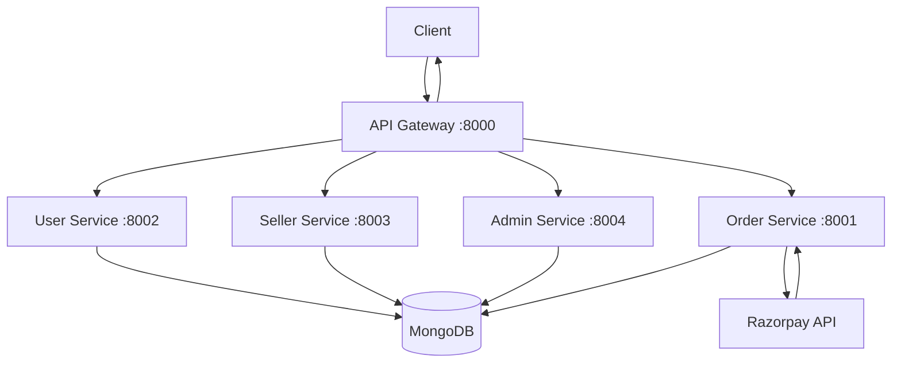
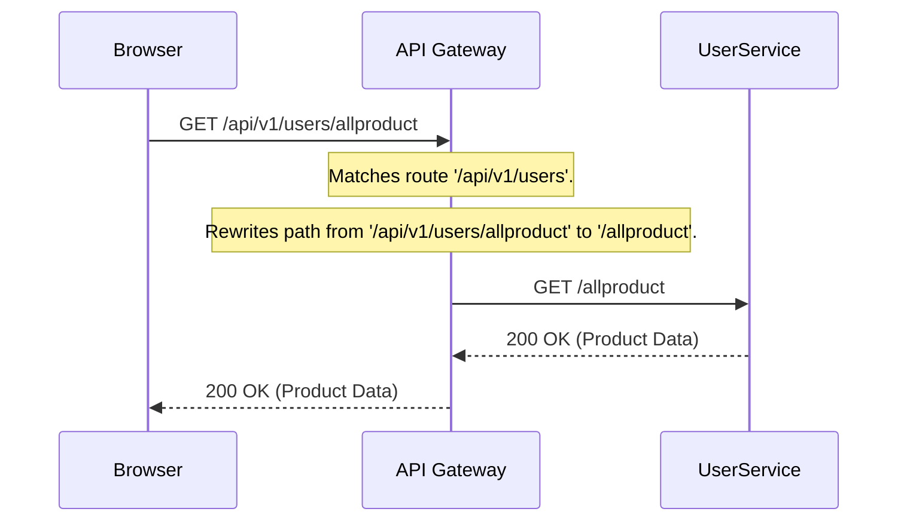
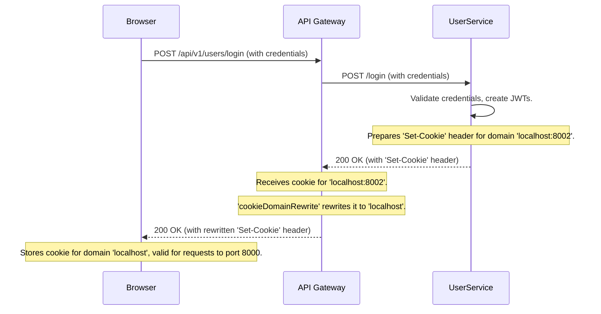
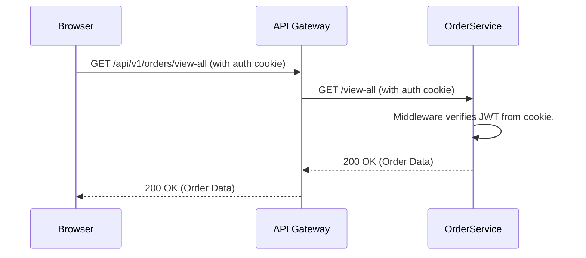
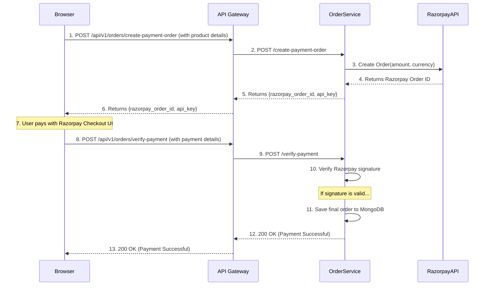
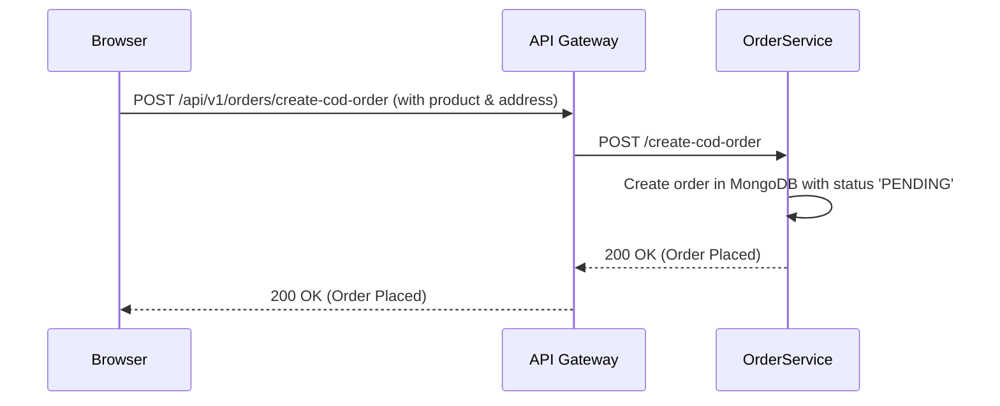
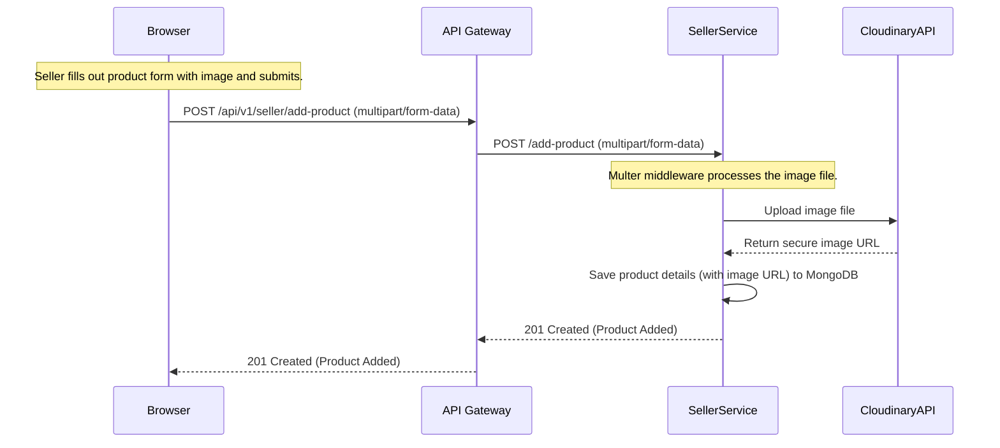
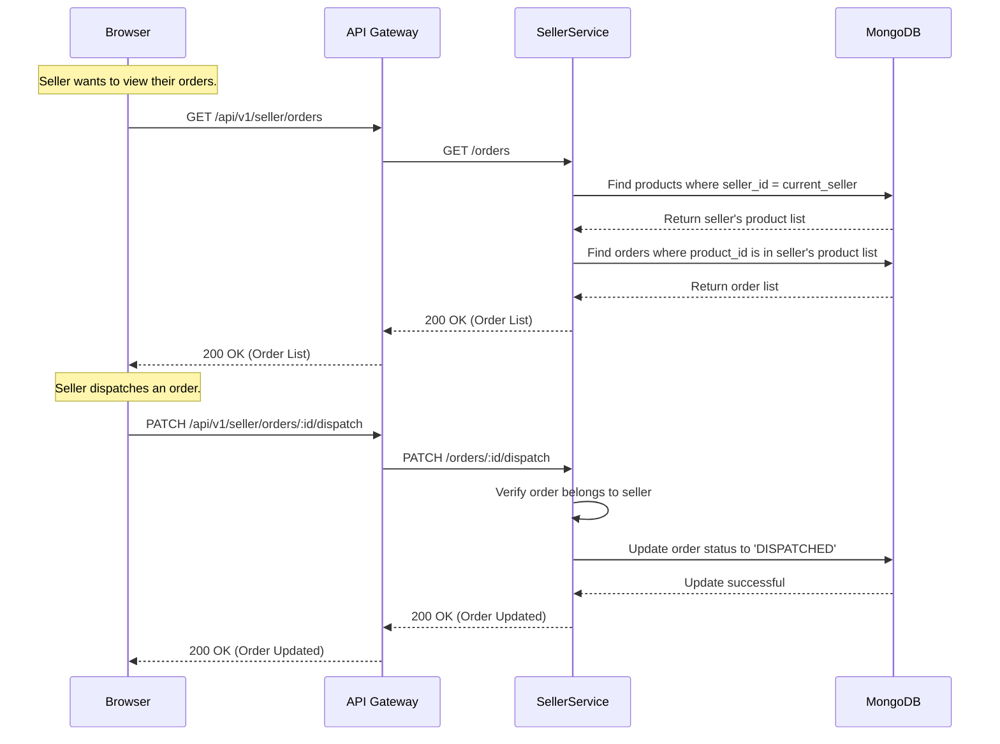

## 🏪 Lonar Marketplace Backend - Microservices Architecture

This is a refactored version of the original monolithic [Lonar Marketplace Backend](https://github.com/NileshRaut-code/Lonar-markate-place-backend) into a microservices-based architecture using **Node.js**, **Express**, **MongoDB**, and **API Gateway** pattern.

---

### 📦 Tech Stack

| Component     | Technology           |
| ------------- | -------------------- |
| Backend       | Node.js, Express     |
| Database      | MongoDB              |
| API Gateway   | Express + http-proxy |
| Auth          | JWT-based Auth       |
| Communication | REST APIs (HTTP)     |
| Environment   | Docker (optional) i will add latter   |

---

### 🧱 Microservices Overview

Each microservice runs independently and handles a specific domain:

| Service           | Description                                 |
| ----------------- | ------------------------------------------- |
| `User-service`    | Handles user registration, login, JWT auth Manages user profiles, roles, data     |
| `seller-service` | Manages product listings, categories        |
| `order-service`   | Handles order processing, cart, checkout ,Integrates with payment gateways     |
| `Admin-service`   | Handles whole App super admin  |
| `gateway`         | Acts as the API Gateway/Proxy               |

---

### 📁 Project Structure

```bash
lonar-marketplace-microservices/
├── user-service/
├── order-service/
├── Seller-service/
├── Admin-service/
├── gateway/               # API Gateway
```

Each service has its own:

* `package.json`
* `.env`
* `Dockerfile` (optional)
* `routes/`, `controllers/`, `models/` (Express structure)

---

### ⚙️ Setup Instructions

#### 1. Clone Repository

```bash
git clone [https://github.com/NileshRaut-code/Lonar-markate-place-backend](https://github.com/NileshRaut-code/Lonar_Backend_Microservices)
cd 
```

> You can split this monolith into folders as per the structure above or use branches/submodules for each service.

---

#### 2. Install Dependencies

Each service must install its own dependencies:

```bash
cd user-service && npm install
cd ../user-service && npm install
...
```

---

#### 3. Environment Variables

Create a `.env` file inside each service directory:

**Example for `user-service`**

```env
PORT=8001
MONGO_URI=mongodb://localhost:27017/
JWT_SECRET=your_jwt_secret
```

Repeat for each service with their specific ports and DB URIs.

---

#### 4. Run Services Individually

```bash
# From each microservice folder
npm start
```

Or use `concurrently` or `pm2` for orchestration in local dev.

---
## 1. Overall System Architecture

This diagram shows the high-level view of the entire system. A single **API Gateway** acts as the entry point for all client requests, routing them to the appropriate backend microservice.



| Component | Responsibility |
| :--- | :--- |
| **API Gateway** | The single entry point for all requests. Handles routing, CORS, authentication cookies, and logging. |
| **User Service** | Manages user registration, login/logout, profile, and viewing products. |
| **Seller Service** | Manages seller-specific actions, like adding and managing their products. |
| **Order Service** | Manages creating and viewing orders. Handles payment integration. |
| **Admin Service** | Manages administrative tasks and has oversight over the platform. |
| **MongoDB** | The shared database. While all services connect to it, they each operate on their own distinct data models. |

---

## 2. Request & Routing Flow

This diagram shows how a request is processed, from the browser to the microservice and back. The key is the `pathRewrite` rule in the gateway, which makes the microservices independent of the public URL structure.

**Example Request:** `GET http://localhost:8000/api/v1/users/allproduct`



**Explanation:**
1.  The Gateway receives the request and matches the `/api/v1/users` prefix.
2.  It **strips that prefix** from the URL, leaving just `/allproduct`.
3.  It forwards the simplified request to the `user-service`.
4.  The `user-service` has a simple router that listens for `/allproduct` at its root, so it matches perfectly.

---

## 3. Authentication Flow (Login & Cookies)

This is the most critical flow. It shows how a user logs in and how the gateway ensures the authentication cookie is set correctly in the browser.




**Key Concept: `cookieDomainRewrite`**
- Without this, the browser would reject the cookie because it came from the gateway (`localhost:8000`) but was for the user service's domain (`localhost:8002`).
- The gateway fixes this by changing the cookie's domain to its own, making the browser trust it.

---

## 4. Authenticated Request Flow

Once logged in, the browser automatically sends the cookie with every subsequent request to the gateway.



**Explanation:**
- The browser sends the cookie it stored during login.
- The gateway transparently passes the cookie along to the `order-service`.
- The `order-service`'s `auth.middleware.js` reads the cookie, verifies the JWT, and attaches the user's data to the request.

---


---

## 5. Create Order Flow (via Razorpay)

This diagram shows the end-to-end process for creating an order using Razorpay for online payment. It involves two main stages: creating the order on Razorpay's servers and then verifying the payment after the user completes it.



---

## 6. Create Order Flow (Cash on Delivery - COD)

The COD flow is simpler as it doesn't involve an external payment provider. The order is created directly in our system with a pending status.



---

## 7. Seller Flow (Add a New Product)

This diagram shows how a seller adds a new product to the platform. This flow includes handling file uploads and interacting with an external service like Cloudinary to store images.



---

---

## 8. Seller Flow (Order Management)

This diagram outlines how a seller manages their orders, from viewing incoming orders for their products to updating an order's status (e.g., dispatching it).



---
### ✅ Features

* Modular microservices
* JWT-based authentication
* MongoDB per service (schema separation)
* Easy horizontal scaling
* Gateway pattern for centralized routing

---

### 📘 Future Improvements

* Service Discovery (via Consul/NATS)
* Event-driven architecture (Kafka/NATS)
* Docker Compose support
*  Circuit Breaker (via gateway)

---

### 🙌 Contribution

Feel free to fork, clone, and raise PRs.

---

### 🔗 Original Monolith Reference

[Monolithic Version]([https://github.com/NileshRaut-code/Lonar-markate-place-backend](https://github.com/NileshRaut-code/Lonar_Backend_Microservices))

---

Would you like me to:

* Generate this as individual folders for each service?
* Write Docker/Compose setup?
* Add Swagger/OpenAPI documentation?

Let me know!
